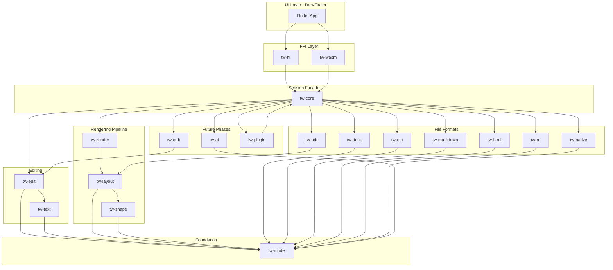

# Crate Map

All Rust code lives in a Cargo workspace under `crates/`. Every crate uses the `tw-` prefix.

## Crate Dependency Graph



## Dependency Rule

**Strictly downward.** A crate may only depend on crates below it in the graph. Specifically:

- `tw-model` depends on nothing except `std`, `serde`, and Unicode utility crates
- `tw-text`, `tw-shape`, `tw-layout`, `tw-render` depend on `tw-model` (and each other as shown)
- `tw-edit` depends on `tw-model` and `tw-text`
- Format crates depend on `tw-model` only (not on layout or render)
- `tw-core` is the only crate that orchestrates across subsystems
- `tw-ffi` and `tw-wasm` depend on `tw-core` only
- No crate in the foundation or editing layers may depend on `tw-ffi`, `tw-wasm`, or any Flutter/Dart code

Violations of this rule will be caught by CI (cargo-deny or a custom lint).

## Crate Specifications

### tw-model

**Purpose:** The document tree — the single source of truth for document content and structure.

**Depends on:** `std`, `serde`, `uuid`

**Public API surface:**
- `NodeId` — stable, unique identifier for every node
- `Document` — root container
- `Section`, `Paragraph`, `Run`, `Table`, `TableRow`, `TableCell`, `Image`, `Shape`, `Break`, `Bookmark`, `Comment`, `Footnote`, `Endnote`
- `CharFormat`, `ParaFormat`, `SectionFormat`, `TableFormat`, `CellFormat`
- `StyleSheet` — named styles with inheritance
- `Revision` — track-changes metadata (author, timestamp, type)

**Does NOT contain:** layout results, rendered glyphs, undo history, file I/O.

### tw-text

**Purpose:** Text buffer operations — the rope-backed storage for run text content.

**Depends on:** `tw-model`, `ropey`

**Public API surface:**
- `TextBuffer` — rope-backed mutable text storage keyed by `RunId`
- `CharIndex`, `ByteIndex` — position types
- `insert(run_id, offset, text)` → updates run length
- `delete(run_id, range)` → updates run length
- `slice(run_id, range)` → borrowed text view
- `grapheme_boundary(offset)` → nearest grapheme cluster boundary

### tw-shape

**Purpose:** Font discovery, text shaping, and glyph rasterization.

**Depends on:** `tw-model`, `rustybuzz`, `swash`, `fontdb`, `icu_properties`

**Public API surface:**
- `FontDatabase` — system font enumeration and fallback chains
- `ShapeRequest { text, char_format, direction, script }`
- `ShapedRun { glyphs: Vec<GlyphInfo>, advances, offsets }`
- `GlyphInfo { glyph_id, cluster, x_offset, y_offset, x_advance, font_id }`
- `GlyphAtlas` — rasterizes glyphs into a shared texture atlas
- `AtlasKey { font_id, glyph_id, size, subpixel }` → atlas coordinates

### tw-layout

**Purpose:** Converts the document model into positioned layout boxes.

**Depends on:** `tw-model`, `tw-shape`, `unicode-linebreak`

**Public API surface:**
- `LayoutEngine` — owns layout state for a document
- `layout_page(page_index) → PageLayout`
- `layout_range(start_node, end_node) → Vec<LayoutBox>`
- `PageLayout { width, height, boxes: Vec<LayoutBox> }`
- `LayoutBox` — positioned element (text line, image, table, shape)
- `TextLine { shaped_runs, baseline, width, ascent, descent }`
- `LineBreakResult { break_opportunity, penalty }`
- `invalidate(node_id)` — mark pages containing this node as dirty

### tw-render

**Purpose:** Converts layout output into a flat, GPU-ready display list.

**Depends on:** `tw-layout`, `tw-shape`

**Public API surface:**
- `DisplayList` — immutable snapshot of draw commands
- `DisplayListBuilder::from_page_layout(page) → DisplayList`
- `AtlasBatch { atlas_key, transforms: Float32Array, rects: Float32Array, colors: Uint32Array }`
- `RectBatch { rects, colors, radii }`
- `PathBatch { paths, fills, strokes }`
- `ImageBatch { image_ids, dest_rects, source_rects }`
- `DisplayList::to_bytes() → Vec<u8>` — flat binary serialization for FFI

### tw-edit

**Purpose:** All document mutations, undo/redo, and the single mutation entry point.

**Depends on:** `tw-model`, `tw-text`

**Public API surface:**
- `Command` enum — every possible edit operation
- `EditSession { model, undo_stack, redo_stack }`
- `apply(session, command) → Result<EditResult, EditError>`
- `undo(session) → Option<Command>`
- `redo(session) → Option<Command>`
- `EditResult { affected_nodes: Vec<NodeId>, inverse: Command }`

**Command variants (Phase 1):**
- `InsertText { run_id, offset, text }`
- `DeleteRange { run_id, range }`
- `SetCharFormat { range, format, merge }`
- `SetParaFormat { paragraph_id, format, merge }`
- `InsertParagraph { after_id }`
- `DeleteParagraph { id }`
- `MergeParagraphs { first_id, second_id }`

**Command variants (Phase 2+):** table ops, image insert/delete, style apply, section break, etc.

### tw-core

**Purpose:** Session facade — the single entry point for the FFI layer.

**Depends on:** all subsystem crates

**Public API surface:**
- `Session::new() → Session`
- `Session::open(path) → Result<DocumentId, Error>`
- `Session::save(doc_id, path, format) → Result<(), Error>`
- `Session::apply(doc_id, command) → EditResult`
- `Session::get_display_list(doc_id, page) → DisplayList`
- `Session::get_page_count(doc_id) → u32`
- `Session::search(doc_id, query) → Vec<SearchResult>`
- `Session::subscribe(doc_id, callback)` — snapshot-ready notifications

### tw-ffi

**Purpose:** C ABI bridge for native platforms (desktop, mobile).

**Depends on:** `tw-core`

**Technology:** `flutter_rust_bridge` or manual C ABI with `cbindgen`

**Exports:** All `Session` methods as `extern "C"` functions. Display lists as flat byte arrays with typed header.

### tw-wasm

**Purpose:** WASM bridge for web platform.

**Depends on:** `tw-core` (compiled to `wasm32-unknown-unknown`)

**Technology:** `wasm-bindgen`

**Exports:** Same API as `tw-ffi`, adapted for JS interop.

### Format Crates

| Crate | Phase | Read | Write |
|-------|-------|------|-------|
| `tw-native` | 1 | `.twdoc` (JSON + assets zip) | `.twdoc` |
| `tw-docx` | 3 | `.docx` | `.docx` |
| `tw-odt` | 3 | `.odt` | `.odt` |
| `tw-markdown` | 3 | `.md` | `.md` |
| `tw-html` | 3 | `.html` | `.html` |
| `tw-rtf` | 3 | `.rtf` | — |
| `tw-pdf` | 2 | — | `.pdf` |

Each format crate exposes crate-level free functions (no shared `FormatHandler` trait). Examples:

| Crate | Import | Export |
|-------|--------|--------|
| `tw-native` | `NativeFormat::import`, `import_plain_text` | `NativeFormat::export` |
| `tw-docx` | `import(source) → ImportResult` | `export(doc, &DocxPackage)` |
| `tw-odt` | `import(source) → ImportResult` | `export(doc, &OdtPackage)` |
| `tw-markdown` | `import(source)` | `export(doc)` |
| `tw-html` | `import(source)` | `export(doc)` |
| `tw-rtf` | `import(source)` | — |

`tw-core` routes through `import_document` / `export_document` in its bundle layer, which dispatches to the appropriate crate function based on detected format.

### Future Crates

Peripheral crates below have varying implementation status. See **[Long-Tail Gaps](../long-tail-gaps.md)** for what is built vs spec.

| Crate | Phase | Purpose |
|-------|-------|---------|
| `tw-ai` | 4 | AI provider abstraction, context building, prompt templates |
| `tw-crdt` | 5 | Yjs integration, operation translation, conflict resolution |
| `tw-plugin` | 6 | Plugin lifecycle, capability sandbox, SDK surface |

## Workspace Layout

```
crates/
  tw-model/          src/lib.rs, src/nodes/, src/styles/, src/format/
  tw-text/           src/lib.rs, src/buffer.rs
  tw-shape/          src/lib.rs, src/fontdb.rs, src/shaper.rs, src/atlas.rs
  tw-layout/         src/lib.rs, src/engine.rs, src/linebreak.rs, src/pagination.rs, src/tables.rs
  tw-render/         src/lib.rs, src/display_list.rs, src/batches.rs
  tw-edit/           src/lib.rs, src/commands.rs, src/session.rs
  tw-core/           src/lib.rs, src/session.rs
  tw-ffi/            src/lib.rs
  tw-wasm/           src/lib.rs
  tw-native/         src/lib.rs
  tw-docx/           src/lib.rs, src/import.rs, src/export.rs, src/opc.rs
  tw-odt/            src/lib.rs
  tw-markdown/       src/lib.rs
  tw-html/           src/lib.rs
  tw-rtf/            src/lib.rs
  tw-pdf/            src/lib.rs
  tw-ai/             src/lib.rs
  tw-crdt/           src/lib.rs
  tw-plugin/         src/lib.rs
Cargo.toml           workspace root
```

## Testing Structure

Each crate has a `tests/` directory. Cross-crate integration tests live in `crates/tw-core/tests/`.

```
crates/tw-layout/tests/
  golden/            reference PNG images for layout output
  fixtures/          .twdoc test documents
  line_break_test.rs
  pagination_test.rs
  table_layout_test.rs

crates/tw-docx/tests/
  corpus/            100+ real-world DOCX files
  round_trip_test.rs
  import_test.rs
```

See [testing-strategy.md](../testing-strategy.md) for the full testing plan.
