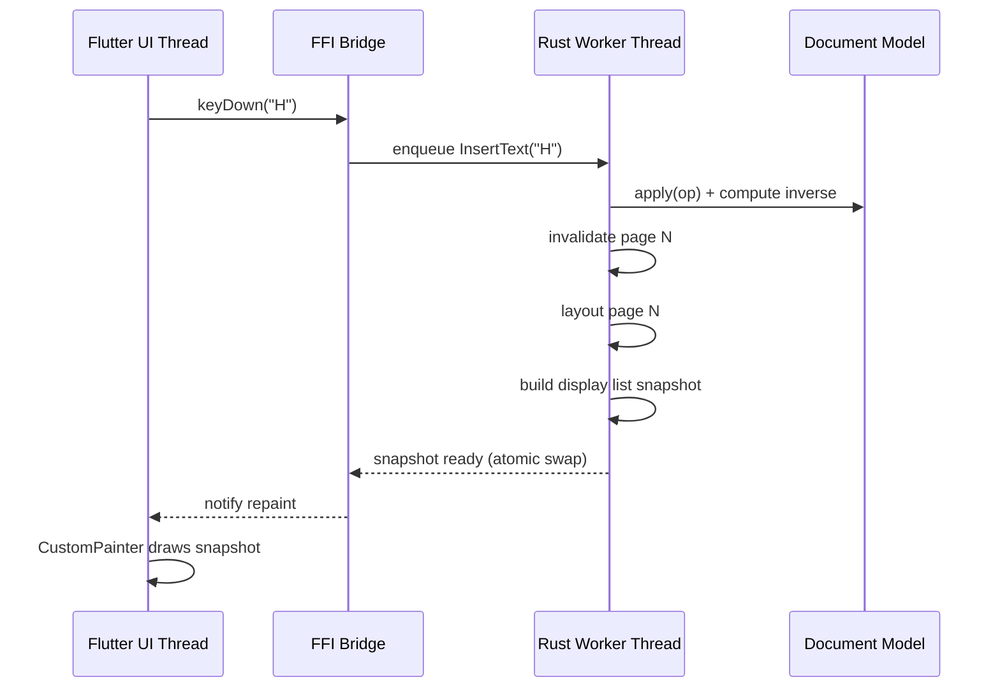

# Architecture Overview

## System Layers

The application is organized into four layers, with a strict separation between UI (Flutter/Dart) and engine (Rust).

```
┌─────────────────────────────────────────────────────────┐
│                     UI Layer (Flutter)                   │
│  Toolbar │ Document View │ Sidebar │ Dialogs │ Settings │
├─────────────────────────────────────────────────────────┤
│                    FFI Bridge Layer                       │
│         tw-ffi (native)  │  tw-wasm (web)               │
├─────────────────────────────────────────────────────────┤
│                   Session Facade (tw-core)                │
│  Orchestrates edit, layout, render, format, AI, CRDT   │
├──────────┬──────────┬──────────┬──────────┬─────────────┤
│ tw-edit  │tw-render │tw-docx   │ tw-ai    │  tw-crdt    │
│ tw-text  │tw-layout │tw-odt    │          │  tw-plugin  │
│          │tw-shape  │tw-pdf ... │          │             │
├──────────┴──────────┴──────────┴──────────┴─────────────┤
│                   Document Model (tw-model)               │
│         Tree of nodes with stable IDs and styles         │
└─────────────────────────────────────────────────────────┘
```

## Process Model

The editor runs as a single process with two logical threads:



### Thread Responsibilities

| Thread | Owns | Must Never |
|--------|------|------------|
| **UI thread** (Flutter) | Input capture, widget tree, painting display lists, animations | Block on layout, parsing, or file I/O |
| **Worker thread** (Rust) | Document mutations, layout, shaping, file I/O, search | Touch Flutter objects or call Dart callbacks synchronously |

Communication is one-directional via a command queue (UI → Rust) and snapshot notification (Rust → UI). The UI thread reads immutable display-list snapshots; it never reads the live document model directly.

## Data Flow

### Edit Flow

```
User input
  → Flutter captures event (key, mouse, paste)
  → FFI serializes to Command enum
  → Worker thread: apply(command) to model
  → Worker thread: push inverse onto undo stack
  → Worker thread: mark affected pages dirty
  → Worker thread: re-layout dirty pages
  → Worker thread: publish new display-list snapshot
  → Flutter: repaint affected pages
```

### Open Document Flow

```
User selects file
  → Flutter: openFile(path) via FFI
  → Worker thread: detect format from extension/MIME
  → Worker thread: tw-docx/tw-odt/etc. parses into model
  → Worker thread: layout all pages (progress callback)
  → Worker thread: publish initial snapshot
  → Flutter: display document, enable editing
```

### Save Document Flow

```
User selects Save/Save As
  → Flutter: saveDocument(path, format) via FFI
  → Worker thread: tw-docx/tw-native serializes model
  → Worker thread: if DOCX, patch original OPC package
  → Worker thread: write to disk
  → Flutter: update window title / status
```

## Rendering Pipeline

Rust owns the entire path from document model to display list. Flutter is a dumb painter.

```
Document Model (tw-model)
        │
        ▼
  Layout Engine (tw-layout)
  ├── Text shaping (tw-shape: rustybuzz + swash)
  ├── Line breaking (unicode-linebreak / icu4x)
  ├── Pagination (page breaks, headers, footers)
  ├── Float placement (images, shapes)
  └── Table layout (cell sizing, merge)
        │
        ▼
  Display List (tw-render)
  ├── GlyphAtlas (rasterized glyph bitmaps)
  ├── AtlasDrawBatch (positions, transforms, rects)
  ├── RectDrawBatch (borders, highlights, rules)
  ├── PathDrawBatch (shapes, lines, curves)
  └── ImageDrawBatch (embedded images, blits)
        │
        ▼
  FFI (zero-copy typed arrays)
        │
        ▼
  Flutter CustomPainter
  ├── canvas.drawRawAtlas() — text glyphs
  ├── canvas.drawRect() — borders, highlights
  ├── canvas.drawPath() — shapes, lines
  └── canvas.drawImageRect() — embedded images
```

See [rendering.md](rendering.md) for the display-list format specification and [ffi-bridge.md](ffi-bridge.md) for the transport details.

## Key Architectural Constraints

These constraints are load-bearing. Violating them requires revisiting ADRs.

1. **Rust owns layout and shaping.** Flutter's `ui.Paragraph` is not used for document text. All text is shaped in Rust and painted via `drawRawAtlas`. (ADR-0003, ADR-0004)

2. **Single mutation path.** Every edit goes through `tw-edit::apply(op)`. No direct model mutation from UI, format parsers, or plugins. (ADR-0007)

3. **Page-granular invalidation.** A keystroke re-layouts only the affected page(s), not the entire document. (ADR-0005)

4. **Immutable snapshots for rendering.** The UI thread reads frozen display lists. The worker thread builds new snapshots and atomically swaps them in. (ADR-0005)

5. **DOCX package passthrough.** Unknown OOXML parts are preserved verbatim on save, not discarded. (ADR-0008)

6. **Strictly downward crate dependencies.** Higher crates depend on lower crates, never the reverse. `tw-model` has no dependencies on layout, rendering, or UI. (See [crate-map.md](crate-map.md))

## Platform Targets

| Platform | UI | Engine | FFI |
|----------|----|--------|-----|
| Windows | Flutter | Rust (native) | tw-ffi (C ABI / flutter_rust_bridge) |
| macOS | Flutter | Rust (native) | tw-ffi |
| Linux | Flutter | Rust (native) | tw-ffi |
| Android | Flutter | Rust (native) | tw-ffi (JNI) |
| iOS | Flutter | Rust (native) | tw-ffi |
| Web | Flutter | Rust (WASM) | tw-wasm |

The same Rust core compiles to native libraries (desktop/mobile) and WASM (web). The Flutter UI codebase is identical across all platforms.

## Module Index

| Module | Spec | Phase |
|--------|------|-------|
| Document Model | [document-model.md](document-model.md) | 1 |
| Text Engine | [text-engine.md](text-engine.md) | 1 |
| Layout Engine | [layout-engine.md](layout-engine.md) | 1–2 |
| Rendering | [rendering.md](rendering.md) | 1 |
| FFI Bridge | [ffi-bridge.md](ffi-bridge.md) | 1 |
| File Formats | [file-formats.md](file-formats.md) | 1–3 |
| DOCX Compatibility | [docx-compatibility.md](docx-compatibility.md) | 3 |
| AI Platform | [ai-platform.md](ai-platform.md) | 4 |
| Collaboration | [collaboration.md](collaboration.md) | 5 |
| Plugins | [plugins.md](plugins.md) | 6 |
| Security | [security.md](security.md) | 6 |
