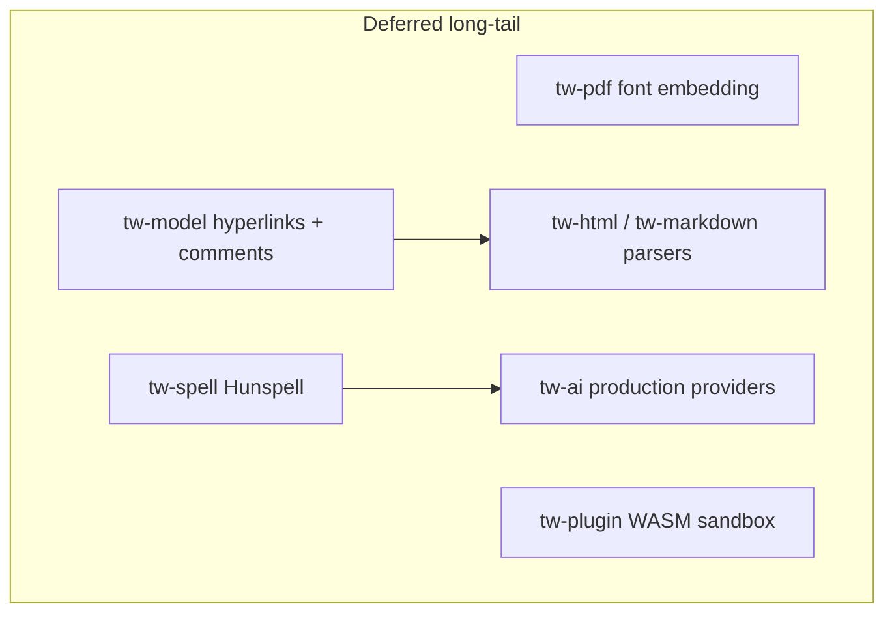

# Long-Tail Gaps

This document is the single source of truth for **partial or unimplemented** work that sits after the core editing pipeline. It describes what the code actually does today, what the architecture docs still promise, and what a future implementation pass would require.

For **risk → mitigation → residual risk** and delivery stages (S0–S5), see [risk-mitigation.md](risk-mitigation.md). This file remains the honesty layer for *code* status when exit criteria are unmet.

For **Flutter ribbon/menu wiring** (what looks enabled vs what works), see [UI Functionality Audit](ui-functionality-audit.md).

Core editing (DOCX import/export fidelity, glyph-mode formatting, layout correctness, CI) is largely complete per Stages 1–4 of the stub-and-gap remediation work. The six areas below are **explicitly deferred** long-tail work. They do not block basic document editing.

---

## Executive summary

| Area | Status | Blocks core editing? | Target phase |
|------|--------|----------------------|--------------|
| [PDF font embedding](#1-pdf-font-embedding-tw-pdf) | Partial — outlines + link annotations; glyph usage tracked for subset | No | Phase 2 |
| [Hunspell spell check](#2-hunspell-spell-check-tw-spell) | MVP — en_US lazy list + embedded core; AI RULES route wired | No | Phase 3 |
| [HTML / Markdown parsers](#3-html--markdown-parsers) | MVP — HTML `a[href]` import; lists/tables still open for MD/ODT | No | Phase 3 |
| [Hyperlinks and comments](#4-hyperlinks-and-comments-tw-model) | Shipped — model + DOCX + UI; glyph follow link works | No | Phase 5 |
| [Plugin WASM sandbox](#5-plugin-wasm-sandbox-tw-plugin) | Host + FFI list/install; invoke via Dart mirror until session hook | No | Phase 6 |
| [Production AI providers](#6-production-ai-providers-tw-ai) | Partial — Flutter HTTP + Translate; Rust RULES→spell; streaming open | No | Phase 4 |
| [Track-change accept/reject UI](#7-track-change-acceptreject-ui) | Shipped — caret + ribbon + **Changes pane** (F17.S2) | No | Phase 2 |

---

## Dependency diagram (future work)

Hyperlink types in the document model are a prerequisite for link import in HTML and Markdown. Hunspell suggestions can back the AI `RULES` spell route once both exist.

---

## Relationship to the stub/gap inventory

The main remediation plan addressed **Severity 1–4** items that made the editor unusable or silently lossy:

- **Stage 1:** DOCX export round-trip (tables, images, numbering, track changes)
- **Stage 2:** Formatting FFI, glyph-mode editing, drag selection
- **Stage 3:** Real font metrics, paragraph page-splitting, justify, text decorations
- **Stage 4:** GitHub Actions CI, criterion benches, golden layout fingerprints

The six areas in this document were always **long-tail** — valuable for fidelity and platform features, but not required for a trustworthy edit/save loop. Treat them as the next backlog after core editing stabilizes.

---

## 1. PDF font embedding (`tw-pdf`) — F23.S2 landed

### Current state (as built)

- Hand-written PDF 1.4 writer in [`crates/tw-pdf/src/lib.rs`](../crates/tw-pdf/src/lib.rs).
- **Structural** (default): Helvetica `/F1`, run `font_size` honored; rect/path batches; **images** as `/XObject` `/Image` (JPEG `/DCTDecode`, PNG raw RGB).
- **VisualMatch / `embed_fonts`:** Type0 + Identity-H + CIDFont; TrueType `/FontFile2`, CFF OpenType `/FontFile3`; TTC faces extracted via [`FontDatabase::load_embeddable_sfnt_by_key`](../crates/tw-shape/src/font_db.rs). Full faces (not subsets) in v1.
- Export reachable via `BridgeCommand::ExportPdf`; Flutter **File → Export PDF…** / **Review → Export PDF**.

### Remaining gap vs full Word visual match

- Glyph subsetting collects used GIDs; full font subsetter not linked yet (faces embed whole SFNT).
- ~~PDF bookmarks, metadata, hyperlinks~~ — **Outlines + link annotations shipped** (Phase 2).

### Exit criteria (Phase 2)

- [x] `/Outlines` from document headings
- [x] Link `/Annot` for hyperlink runs
- [x] Glyph usage tracked for subset intent
- [ ] True GID subsetting (size win deferred)

### Key files

| File | Role |
|------|------|
| `crates/tw-pdf/src/lib.rs` | `DisplayListPdfExporter`, embed + image XObjects |
| `crates/tw-shape/src/font_db.rs` | Embeddable SFNT / TTC extract |
| `crates/tw-core/src/worker.rs` | `ExportPdf` command |
| `app/lib/editor/editor_controller.dart` | `exportPdf()` |

### Future work

1. Subset embedded faces to used GIDs.
2. ~~Map structural export to Helvetica-Bold/Oblique by run style.~~ Done (structural path).
3. PDF outline / link annotations.

---

## 2. Hunspell spell check (`tw-spell`)

### Current state (as built)

- [`crates/tw-spell/src/lib.rs`](../crates/tw-spell/src/lib.rs): lazy **`english_us()`** dictionary (`OnceLock`) + edit-distance **`suggest()`**.
- Dictionaries: [`en_core.txt`](../crates/tw-spell/data/en_core.txt) + expanded [`en_us.txt`](../crates/tw-spell/data/en_us.txt) (embedded word lists, not full Hunspell `.aff`/`.dic`).
- AI **`RULES`** route in [`tw-ai/router.rs`](../crates/tw-ai/src/router.rs) calls `tw_spell::SpellChecker::english_us()` for spell-fix completions.
- Worker integration returns **`SpellCheckResult` JSON** with offsets and suggestions to Flutter.
- Review tab **spell suggestions dialog** lets users pick replacements.

### Remaining gap vs spec

- Full **Hunspell** `.aff`/`.dic` backends for English + Indic.
- Grammar checking beyond spell.

### Exit criteria (Phase 3)

- [x] `"teh"` flagged; top suggestion `"the"` (en_US list + suggest)
- [x] Flutter shows suggestion list when engine is connected
- [x] AI RULES route wired to spell suggest
- [ ] Optional Hindi `.aff`/`.dic` lazy load

---

## 3. HTML / Markdown / ODT parsers — F23.S3 heading/roundtrip landed

### HTML (`tw-html`)

**Current state:**

- Hand-rolled scanner; import tags: `h1`–`h6`, `p`, `div`, `b`/`strong`, `i`/`em`, `br`.
- Export maps **Heading 1–6 by style name** → `<h1>`–`<h6>`; Quote/Caption/Normal → `
` (F23.S3).
- Heading StyleIds resolved from the target document’s stylesheet (no foreign UUID).
- **Shipped (Phase 5):** `a[href]` → `RunContent::Hyperlink`; basic table rows from `<tr>` boundaries.
- **Still open:** full list numbering, images, underline, `html5ever`.

### Markdown (`tw-markdown`)

**Current state:**

- `pulldown_cmark`; headings/paragraphs/bold/italic/breaks.
- **Shipped (Phase 5):** `[text](url)` hyperlinks, bullet/numbered lists (`NumberingRef`), pipe tables, fenced code → monospace.
- Export emits ATX markers for Heading 1–6; tables export as GitHub pipe tables.

### ODT (`tw-odt`)

**Current state (F23.S3 + Phase 5):**

- Import/export paragraphs + `text:h` outline levels; bold/italic spans.
- **Shipped (Phase 5):** `text:list-item` → bullet numbering, `table:table` blocks, `draw:frame` image import from package parts.
- **Still open:** full `styles.xml` / meta fidelity, nested lists.

### Gap vs full format matrix

- [`docs/architecture/file-formats.md`](architecture/file-formats.md) still targets `html5ever` + full link/list/table mapping.

### Exit criteria remaining

- Round-trip tests for lists, links, and tables without block loss.

---

## 4. Hyperlinks and comments (`tw-model`)

### Current state (as built)

- [`crates/tw-model/src/nodes.rs`](../crates/tw-model/src/nodes.rs) and [`vocabulary.rs`](../crates/tw-model/src/vocabulary.rs) (R2.1, 2026-08-06):
  - `RunContent`: **Text, Tab, Break**, plus **Hyperlink, Field, InlineImage, FootnoteRef, CommentRef, Bookmark**
  - `Block`: **Paragraph, Table, ImageBlock**, plus **ShapeBlock**
  - `Section.headers` / `Section.footers`: typed `HashMap<HeaderFooterType, HeaderFooter>` (legacy `SectionFormat.header_blocks` retained for serde compat)
  - Public enums marked `#[non_exhaustive]` for forward-compatible extension
- `CharFormat` has no URL or hyperlink field ([`format.rs`](../crates/tw-model/src/format.rs)) — hyperlinks live in `RunContent::Hyperlink`.
- `Document` has no `comments` collection ([`document.rs`](../crates/tw-model/src/document.rs)).
- `tw-docx` import parses `w:hyperlink`, `w:fldSimple`, footnote/comment refs, bookmarks, shapes, and all header/footer reference types; **`ImportRetentionReport`** on `ImportResult` counts encountered vs retained OOXML elements.
- Track-changes **`Revision`** metadata on runs **is** implemented and round-trips through DOCX.

### Gap vs spec

- [`docs/architecture/document-model.md`](architecture/document-model.md): `Comment` threads, `Document.comments`, full hyperlink styling, and field update — **partially built** (R2.1 vocabulary + import retention).
- [`docs/architecture/collaboration.md`](architecture/collaboration.md): `CommentThread`, CRDT-synced comments — **spec only**.
- [`docs/architecture/docx-compatibility.md`](architecture/docx-compatibility.md): comments part Phase 5 — anchors imported as `CommentRef`, body not parsed.
- Layout/render: placeholder text for new run variants; no link styling or comment margin markers yet.

### Key files

| Area | File |
|------|------|
| Model | `crates/tw-model/src/nodes.rs`, `format.rs`, `document.rs` |
| Edit | `crates/tw-edit/src/command.rs` (no hyperlink/comment commands) |
| DOCX | `crates/tw-docx/src/paragraph.rs` |
| Layout/render | No link styling or comment margin markers |

### Future work

1. ~~Add model vocabulary for hyperlinks, fields, bookmarks~~ (R2.1 done).
2. Add `Document.comments: Vec<CommentThread>` and edit commands: `InsertHyperlink`, `AddComment`, `ReplyComment`, `ResolveComment`.
3. Layout: blue underline, link hit-test; comment anchors in margin (rect batch).
4. DOCX: parse `word/comments.xml` body; round-trip hyperlink `r:id` targets.
5. FFI + Flutter: References/Review tabs.

### Exit criteria (documentation target)

- Clickable links in glyph view; DOCX hyperlink round-trip.
- Comment anchor survives native `.twdoc` serialize/deserialize.

---

## 5. Plugin WASM sandbox (`tw-plugin`)

### Current state (as built — F26.S3 + Phase 7)

- [`crates/tw-plugin`](../crates/tw-plugin/): wasmtime sandbox, capability-gated host imports, install/enable/disable/invoke.
- FFI: `tw_plugin_list_json`, `tw_plugin_install_sample` in [`tw-ffi`](../crates/tw-ffi/src/lib.rs); Flutter syncs `PluginRegistry` from native when available.
- Sample WAT plugins + tests in `tests/f26_s3_plugin_host.rs`.
- Flutter: Review → Plugins dialog; invoke still uses Dart mirror until session-scoped `tw_plugin_invoke` lands.
- Still missing: WASI/WIT marketplace SDK, signed marketplace packages.

### Exit criteria (Phase 7)

- [x] FFI list / install sample plugin
- [x] Review → Plugins dialog wired
- [x] Sample plugin invoke with capability denial (Dart mirror + Rust host tests)
- [ ] Session-scoped native invoke → undoable edit in one FFI call

### Gap vs spec

- [`docs/architecture/plugins.md`](architecture/plugins.md) describes wasmtime sandbox, marketplace, SDK — **"implementation is deferred to Phase 6"** (accurate).
- Phase 6 deliverables: grammar plugins, citation manager, diagram inserter.

### Key files

| File | Role |
|------|------|
| `crates/tw-plugin/src/lib.rs` | Trait surface |
| `docs/architecture/plugins.md` | Full target architecture |

### Future work

1. Lifecycle: install, enable, disable, uninstall from manifest JSON.
2. `wasmtime` + WASI; WIT host interface for document read/edit.
3. Enforce capabilities at host boundary; deny network/filesystem by default.
4. Worker hook: async plugin dispatch on background thread.
5. Sample plugin under `examples/plugins/`.

### Exit criteria (documentation target)

- Sample WASM plugin reads document text and applies an undoable `InsertText`.
- Capability denial when `document.edit` not granted.

---

## 6. Production AI providers (`tw-ai`)

### Current state (as built) — F28.S1 + Phase 6 partial

- [`crates/tw-ai/src/provider.rs`](../crates/tw-ai/src/provider.rs): `AiProvider` trait (`complete`, `stream`, `is_available`).
- [`crates/tw-ai/src/router.rs`](../crates/tw-ai/src/router.rs): `HybridRouter` with local/cloud/policy routing.
- **Production adapters:** OpenAI, Gemini, llama.cpp / Ollama-compatible HTTP; injectable `MockHttpClient` (no network in CI).
- Flutter: `AiClient` + Review → **AI Settings** / **Translate** via live HTTP when keys/endpoints configured.
- **`RULES` route** → `tw_spell::SpellChecker::english_us()` spell-fix (no longer `NotImplemented`).
- `AiModuleRegistry::sync_endpoint_availability` marks grammar/writing (local) and translation/reasoning (cloud) when endpoints exist.
- `CompletionStream` is still an **empty struct** (streaming chunks not wired to UI).

### Environment keys (Flutter / desktop)

| Variable | Purpose |
|----------|---------|
| `OPENAI_API_KEY` | Cloud OpenAI completions (Review → AI Settings) |
| `GEMINI_API_KEY` | Google Gemini cloud provider |
| `TUTUAWORD_OPENAI_API_KEY` | Alias read by `AiClient` when set |
| Ollama default | `http://127.0.0.1:11434` — auto-started on desktop when Always Local / Automatic |

### Gap vs spec

- F28.S1–S6 AI feature set complete (providers, rewrite, chat/RAG, generation, visual assist, smart edit).
- RAG is keyword-overlap (no embeddings); Flutter chunks `documentText` by newlines until FFI exposes paragraph ids.
- Generated docs open as plain text in Flutter (heading styles applied in Rust model; Flutter mock inserts plain text).
- Timeline visuals insert as 1×N tables (not a dedicated timeline shape).
- Smart-edit TOC inverse not supported; heading styles undo as one step, TOC apply is separate.
- FFI session methods for AI not exposed; Flutter uses a Dart facade until FFI lands.
- Native/WASM `replaceRangeAsync` still composes delete+insert (two undo steps); mock uses single undo.
- Review **Translate** still inert.

### Key files

| File | Role |
|------|------|
| `crates/tw-ai/src/provider.rs` | Trait + constants |
| `crates/tw-ai/src/providers/` | OpenAI / Gemini / llama adapters |
| `crates/tw-ai/src/router.rs` | `HybridRouter`, RULES stub |
| `crates/tw-ai/src/service.rs` | `AiServiceImpl` (summarize, rewrite, …) |
| `app/lib/bridge/ai_client.dart` | Flutter facade + mock HTTP |

### Future work

1. Real HTTP client behind feature flag (`reqwest` or `ureq`).
2. Wire `RULES` route to `tw-spell` suggest API once Hunspell lands.
3. Minimal `CompletionStream` channel for streaming UI.
4. FFI + Review tab: Rewrite, Translate → Commands (F28.S2).

### Exit criteria (documentation target)

- Ollama rewrite works offline with default local endpoint.
- Cloud provider works with `TUTUAWORD_OPENAI_API_KEY`.
- Spell/grammar route no longer returns `NotImplemented`.

---

## 7. Track-change accept/reject UI

### Current state (as built) — Phase 1 shipped

- **Track-changes flag** toggles via Review ribbon and Tools menu.
- `Command::AcceptRevision` / `RejectRevision` at caret + accept/reject all in `tw-edit` with undo.
- FFI: `tw_accept_revision_at`, `tw_reject_revision_at`, next/prev navigation, `tw_get_revisions` JSON list.
- Flutter: Review ribbon Accept/Reject/Next/Previous + **Changes pane** (`changes_pane.dart`) with jump + per-item accept/reject.
- DOCX export emits revision markup when tracking is on.

### Exit criteria (Phase 1)

- [x] Accept/reject at caret from Review ribbon
- [x] Next/previous change navigation
- [x] Changes list pane (run id / summary / jump)
- [x] Undo restores prior revision state

---

## Recommended future order

| Order | Workstream | Effort (estimate) | Depends on |
|-------|-----------|-------------------|------------|
| 1 | PDF font embedding | ~1 week | — |
| 2 | Hunspell + suggest | ~1 week | — |
| 3 | Hyperlinks + comments model | ~2 weeks | — |
| 4 | HTML/MD parsers | ~1.5 weeks | Hyperlinks |
| 5 | Plugin WASM sandbox | ~2–3 weeks | Stable Command JSON |
| 6 | AI providers | ~1.5 weeks | Hunspell for RULES route |

PDF and Hunspell can proceed in parallel. Hyperlinks block parser link support. Plugin and AI work are best after the document model and spell API stabilize.

---

## See also

- [Roadmap](roadmap.md) — phase exit criteria
- [Crate map](architecture/crate-map.md) — peripheral crate index
- [File formats](architecture/file-formats.md) — import/export matrix
- [Testing strategy](testing-strategy.md) — corpus and benchmark targets
- [UI Functionality Audit](ui-functionality-audit.md) — ribbon/menu control wiring and P0/P1/P2 status
