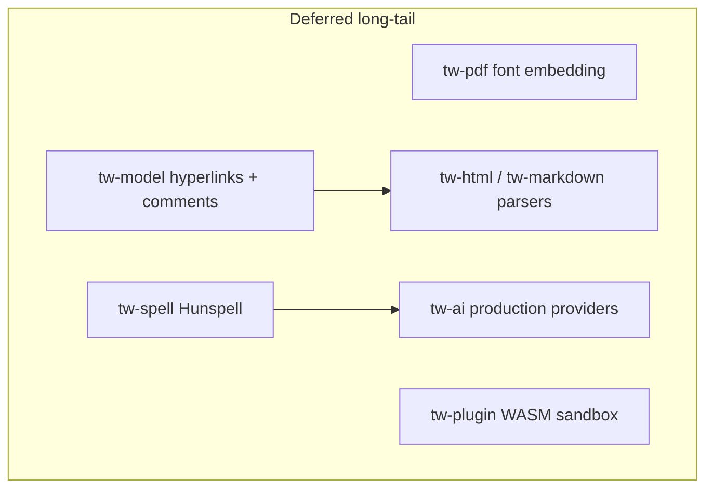

# Long-Tail Gaps

This document is the single source of truth for **partial or unimplemented** work that sits after the core editing pipeline. It describes what the code actually does today, what the architecture docs still promise, and what a future implementation pass would require.

For **Flutter ribbon/menu wiring** (what looks enabled vs what works), see [UI Functionality Audit](ui-functionality-audit.md).

Core editing (DOCX import/export fidelity, glyph-mode formatting, layout correctness, CI) is largely complete per Stages 1–4 of the stub-and-gap remediation work. The six areas below are **explicitly deferred** long-tail work. They do not block basic document editing.

---

## Executive summary

| Area | Status | Blocks core editing? | Target phase |
|------|--------|----------------------|--------------|
| [PDF font embedding](#1-pdf-font-embedding-tw-pdf) | Partial — real glyph positions, fixed Helvetica 12pt | No | Phase 2 |
| [Hunspell spell check](#2-hunspell-spell-check-tw-spell) | Stub — embedded word list, no suggestions | No | Phase 3 |
| [HTML / Markdown parsers](#3-html--markdown-parsers) | MVP — basic text formatting only | No | Phase 3 |
| [Hyperlinks and comments](#4-hyperlinks-and-comments-tw-model) | Not started in code | No | Phase 5 |
| [Plugin WASM sandbox](#5-plugin-wasm-sandbox-tw-plugin) | Spec + traits only | No | Phase 6 |
| [Production AI providers](#6-production-ai-providers-tw-ai) | Router + mocks only | No | Phase 4 |
| [Track-change accept/reject UI](#7-track-change-acceptreject-ui) | Toggle only; Review Accept/Reject disabled | No | Phase 2 |

---

## Dependency diagram (future work)

Hyperlink types in the document model are a prerequisite for link import in HTML and Markdown. Hunspell suggestions can back the AI `RULES` spell route once both exist.

---

## Relationship to the stub/gap inventory

The main remediation plan addressed **Severity 1–4** items that made the editor unusable or silently lossy:

- **Stage 1:** DOCX export round-trip (tables, images, numbering, track changes)
- **Stage 2:** Formatting FFI, glyph-mode editing, drag selection
- **Stage 3:** Real font metrics, paragraph page-splitting, justify, text decorations
- **Stage 4:** GitHub Actions CI, criterion benches, golden layout fingerprints

The six areas in this document were always **long-tail** — valuable for fidelity and platform features, but not required for a trustworthy edit/save loop. Treat them as the next backlog after core editing stabilizes.

---

## 1. PDF font embedding (`tw-pdf`)

### Current state (as built)

- Hand-written PDF 1.4 writer in [`crates/tw-pdf/src/lib.rs`](../crates/tw-pdf/src/lib.rs).
- Layout drives text export: walks `PageLayout` text lines and table cell lines, emits one `Tj` operator per glyph at layout `(x, y)` with PDF Y-axis flip.
- Glyphs carry real `codepoint` values from the layout engine (no longer placeholder `X` characters).
- Single built-in font: **Helvetica `/F1` at 12pt** for all text (`/F1 12 Tf` hardcoded).
- Display list contributes **rect** and **path** batches (highlights, table grid lines). **Atlas glyphs and images are not written** to the PDF.
- `PdfExportOptions` has one field, `embed_fonts: bool`, which defaults to `false` and is **ignored** (`_options` in `export()`).
- Export is reachable from the worker via `BridgeCommand::ExportPdf`; Flutter **`EditorController.exportPdf()`** is wired from **File → Export PDF…** and **Review → Export PDF** (Phase C, 2026-08-05). Output still uses fixed Helvetica 12pt until font embedding lands.

### Gap vs spec

- [`docs/roadmap.md`](roadmap.md) Phase 2 exit criterion: **PDF visual match** against Word print output.
- [`docs/architecture/file-formats.md`](architecture/file-formats.md): bookmarks, metadata, hyperlinks in PDF structure — none implemented.
- Document font family, size, bold, and italic are not reflected in PDF output.

### Key files

| File | Role |
|------|------|
| `crates/tw-pdf/src/lib.rs` | `DisplayListPdfExporter`, `MinimalPdfWriter` |
| `crates/tw-shape/src/font_db.rs` | Face bytes and metrics (reuse for embedding) |
| `crates/tw-core/src/worker.rs` | `ExportPdf` command |
| `app/lib/editor/editor_controller.dart` | `exportPdf()` |
| `app/lib/ui/ribbon_tabs/review_tab.dart` | Review → Export PDF button |
| `app/lib/editor/editor_menu.dart` | File → Export PDF… |

### Future work

1. Map runs to Standard 14 fonts when `embed_fonts: false`; honor `CharFormat.font_size` and family name.
2. When `embed_fonts: true`, subset TTF/OTF from `fontdb` and write `/FontFile2` streams for glyphs used on each page.
3. Group consecutive glyphs sharing font + size into fewer `BT … Tj … ET` blocks.
4. Wire `embed_fonts` in `PdfExportOptions`; add Save-as-PDF to ribbon or File menu.

### Exit criteria (documentation target)

- Exported PDF uses correct point sizes per run.
- With `embed_fonts: true`, non-Latin text renders in Preview/Acrobat using embedded subsets.
- Integration test asserts `/BaseFont` or `/FontFile2` and non-12pt `Tf` operators.

---

## 2. Hunspell spell check (`tw-spell`)

### Current state (as built)

- [`crates/tw-spell/src/lib.rs`](../crates/tw-spell/src/lib.rs) uses an in-memory `HashSet<String>`.
- Dictionary: ~384 tokens from [`crates/tw-spell/data/en_core.txt`](../crates/tw-spell/data/en_core.txt) plus hardcoded Indic-Latin tokens (`namaste`, city names, etc.).
- Public API:
  - `SpellChecker::english()` / `with_extra_words()`
  - `is_correct(word) -> bool`
  - `check_text(text) -> Vec<SpellIssue>` with byte `start`/`end` offsets
- **No `suggest()` or correction API.**
- Sole dependency: `unicode-segmentation` for word-boundary tokenization.
- Worker integration: `SpellChecker::english().check_text()` on plain document text; bridge event returns **misspelling words only** (offsets and suggestions not forwarded to Flutter).

### Gap vs spec

- [`docs/roadmap.md`](roadmap.md) Phase 3: **Hunspell, English + Indic languages**.
- [`docs/glossary.md`](glossary.md) and testing strategy assume real dictionaries.
- Review tab spell-check UI cannot offer replacements.

### Key files

| File | Role |
|------|------|
| `crates/tw-spell/src/lib.rs` | Checker implementation |
| `crates/tw-spell/data/en_core.txt` | Embedded mini corpus |
| `crates/tw-core/src/worker.rs` | `SpellCheckDocument` → `BridgeEvent::SpellCheckResult` |
| `app/lib/ui/ribbon_tabs/review_tab.dart` | Spell UI (partial) |

### Future work

1. Add Hunspell backend (`hunspell-rs` or similar); ship `.aff`/`.dic` under `crates/tw-spell/data/`.
2. Add `suggest(&self, word: &str, limit: usize) -> Vec<String>`.
3. Lazy-load dictionaries on first check; keep embedded list as offline fallback.
4. Extend FFI to return JSON `{ word, start, end, suggestions[] }`; surface in Review tab.

### Exit criteria (documentation target)

- `"teh"` flagged; top suggestion `"the"`.
- Optional Hindi dictionary loads without blocking app startup.
- Flutter shows suggestion list when engine is connected.

---

## 3. HTML / Markdown parsers

### HTML (`tw-html`)

**Current state:**

- [`crates/tw-html/src/import.rs`](../crates/tw-html/src/import.rs) — hand-rolled **character scanner**, not a DOM parser.
- Supported import tags: `h1`, `p`, `div`, `b`/`strong`, `i`/`em`, `br`.
- Export ([`export.rs`](../crates/tw-html/src/export.rs)): maps styled paragraphs to `<h1>`, `
`, `<strong>`, `<em>`, `<mark>` for revisions.
- **Not supported:** `a[href]`, tables, images, headings h2–h6, lists, underline.

### Markdown (`tw-markdown`)

**Current state:**

- [`crates/tw-markdown/src/lib.rs`](../crates/tw-markdown/src/lib.rs) uses `pulldown_cmark`.
- Supported: headings, paragraphs, bold, italic, soft/hard breaks.
- **List events explicitly ignored** (`Tag::List`, `Tag::Item` → no-op).
- **Links, tables, code blocks** — unhandled (`_ => {}`).
- Export emits `# ` for any paragraph with a style id; no list or link syntax.

### Gap vs spec

- [`docs/architecture/file-formats.md`](architecture/file-formats.md) specifies **`html5ever` + `markup5ever_rcdom`** for HTML and full mapping tables (e.g. `[text](url)` → hyperlink run).
- Format matrix marks both crates Phase 3 **Yes/Yes** — functionally partial.

### Key files

| Crate | Import | Export |
|-------|--------|--------|
| `tw-html` | `import(source)` | `export(doc)` |
| `tw-markdown` | `import(source)` | `export(doc)` |

Tests: [`crates/tw-html/tests/export_import.rs`](../crates/tw-html/tests/export_import.rs) (heading, bold, revision mark only).

### Future work

1. Replace HTML scanner with `html5ever`; walk DOM for semantic block/inline elements.
2. Complete pulldown_cmark handler for `Tag::Link`, lists, and tables.
3. Map `<a href>` and `[text](url)` to hyperlink metadata (**requires [§4](#4-hyperlinks-and-comments-tw-model)**).
4. Align export with import (lists, links, tables).

### Exit criteria (documentation target)

- Round-trip tests for lists, links, and tables without block loss.
- HTML export no longer maps every styled paragraph to `<h1>`.

---

## 4. Hyperlinks and comments (`tw-model`)

### Current state (as built)

- [`crates/tw-model/src/nodes.rs`](../crates/tw-model/src/nodes.rs):
  - `RunContent`: **Text, Tab, Break** only
  - `Block`: **Paragraph, Table, ImageBlock** only
- `CharFormat` has no URL or hyperlink field ([`format.rs`](../crates/tw-model/src/format.rs)).
- `Document` has no `comments` collection ([`document.rs`](../crates/tw-model/src/document.rs)).
- Track-changes **`Revision`** metadata on runs **is** implemented and round-trips through DOCX.

### Gap vs spec

- [`docs/architecture/document-model.md`](architecture/document-model.md): `Comment`, `Bookmark`, `RunContent::Field`, `Block::ShapeBlock`, typed header/footer map — **specified, not built**.
- [`docs/architecture/collaboration.md`](architecture/collaboration.md): `CommentThread`, CRDT-synced comments — **spec only**.
- [`docs/architecture/docx-compatibility.md`](architecture/docx-compatibility.md): comments part Phase 5 — not parsed.
- `tw-docx` has no hyperlink or comment range parsing in paragraph import.

### Key files

| Area | File |
|------|------|
| Model | `crates/tw-model/src/nodes.rs`, `format.rs`, `document.rs` |
| Edit | `crates/tw-edit/src/command.rs` (no hyperlink/comment commands) |
| DOCX | `crates/tw-docx/src/paragraph.rs` |
| Layout/render | No link styling or comment margin markers |

### Future work

1. Add `CharFormat.hyperlink: Option<HyperlinkTarget>` and `Document.comments: Vec<CommentThread>`.
2. Edit commands: `InsertHyperlink`, `AddComment`, `ReplyComment`, `ResolveComment`.
3. Layout: blue underline, link hit-test; comment anchors in margin (rect batch).
4. DOCX: parse `w:hyperlink`, preserve `word/comments.xml` via OPC passthrough.
5. FFI + Flutter: References/Review tabs.

### Exit criteria (documentation target)

- Clickable links in glyph view; DOCX hyperlink round-trip.
- Comment anchor survives native `.twdoc` serialize/deserialize.

---

## 5. Plugin WASM sandbox (`tw-plugin`)

### Current state (as built)

- [`crates/tw-plugin/src/lib.rs`](../crates/tw-plugin/src/lib.rs) (~93 lines):
  - `Capability` enum, `PluginManifest`, `PluginContext::has_capability`
  - `Plugin` trait (`on_activate`, `on_deactivate`, `on_command`)
  - `PluginDocument` trait (read text, `apply_edit(Command)`)
  - `PluginManager`: **`register()`** and **`plugin_count()`** only
- **No** wasmtime, lifecycle (install/enable/disable), capability enforcement at runtime, or message routing.
- **`PluginDocument` has zero implementations** in the workspace.
- `tw-core` lists `tw-plugin` as a dependency but does not host plugins in the worker.

### Gap vs spec

- [`docs/architecture/plugins.md`](architecture/plugins.md) describes wasmtime sandbox, marketplace, SDK — **"implementation is deferred to Phase 6"** (accurate).
- Phase 6 deliverables: grammar plugins, citation manager, diagram inserter.

### Key files

| File | Role |
|------|------|
| `crates/tw-plugin/src/lib.rs` | Trait surface |
| `docs/architecture/plugins.md` | Full target architecture |

### Future work

1. Lifecycle: install, enable, disable, uninstall from manifest JSON.
2. `wasmtime` + WASI; WIT host interface for document read/edit.
3. Enforce capabilities at host boundary; deny network/filesystem by default.
4. Worker hook: async plugin dispatch on background thread.
5. Sample plugin under `examples/plugins/`.

### Exit criteria (documentation target)

- Sample WASM plugin reads document text and applies an undoable `InsertText`.
- Capability denial when `document.edit` not granted.

---

## 6. Production AI providers (`tw-ai`)

### Current state (as built)

- [`crates/tw-ai/src/provider.rs`](../crates/tw-ai/src/provider.rs): `AiProvider` trait (`complete`, `stream`, `is_available`).
- [`crates/tw-ai/src/router.rs`](../crates/tw-ai/src/router.rs): `HybridRouter` with local/cloud/policy routing; provider ID constants (OpenAI, Ollama, Claude, etc.).
- **No production `impl AiProvider`** in non-test code.
- **`MockProvider`** exists only under `#[cfg(test)]` in `service.rs` / `router.rs`.
- `CompletionStream` is an **empty struct** (streaming not implemented).
- **`RULES` route** returns `AiError::NotImplemented` for spell/grammar tasks.
- `AiModuleRegistry`: metadata only; all modules `installed: false`.
- No HTTP client dependency in `Cargo.toml`.

### Gap vs spec

- [`docs/architecture/ai-platform.md`](architecture/ai-platform.md) and [ADR-0010](adr/0010-ai-provider-abstraction.md) describe multi-provider hybrid routing — **routing exists; providers do not**.
- [`docs/roadmap.md`](roadmap.md) Phase 4: built-in AI rewrite, summarize, translate.
- Review tab AI actions are inert in Flutter.

### Key files

| File | Role |
|------|------|
| `crates/tw-ai/src/provider.rs` | Trait + constants |
| `crates/tw-ai/src/router.rs` | `HybridRouter`, RULES stub |
| `crates/tw-ai/src/service.rs` | `AiServiceImpl` (summarize, rewrite, …) |

### Future work

1. HTTP client behind feature flag (`reqwest` or `ureq`).
2. Implement **Ollama** (local) and **OpenAI-compatible** (cloud) providers; keys from env only.
3. Wire `RULES` route to `tw-spell` suggest API once Hunspell lands.
4. Minimal `CompletionStream` channel for streaming UI.
5. FFI + Review tab: Rewrite, Translate.

### Exit criteria (documentation target)

- Ollama rewrite works offline with default local endpoint.
- Cloud provider works with `TUTUAWORD_OPENAI_API_KEY`.
- Spell/grammar route no longer returns `NotImplemented`.

---

## 7. Track-change accept/reject UI

### Current state (as built)

- **Track-changes flag** toggles via Review ribbon and Tools menu (`EditorController.toggleTrackChanges` → worker).
- DOCX export can emit revision markup when the flag is on (Stage 1 work).
- Review ribbon **Accept** and **Reject** buttons are **disabled** with an explicit tooltip: accept/reject **edit commands** do not exist in `tw-edit` yet.
- No FFI for `AcceptRevision` / `RejectRevision`; no balloon UI or change list.

### Gap vs spec

- Word-like review workflow requires per-change accept/reject, accept all, reject all, and navigation between revisions.
- [`docs/ui-functionality-audit.md`](ui-functionality-audit.md) lists Accept/Reject as P1 partial.

### Key files

| File | Role |
|------|------|
| `crates/tw-edit/src/lib.rs` | Needs accept/reject revision commands |
| `crates/tw-model/src/revision.rs` | Revision metadata on runs |
| `app/lib/ui/ribbon_tabs/review_tab.dart` | Accept/Reject placeholders (`kTrackChangeReviewTooltip`) |

### Future work

1. Add `Command::AcceptRevision` / `Command::RejectRevision` (and range variants) in `tw-edit`.
2. Worker + FFI bridge; wire Review ribbon Accept/Reject.
3. Optional: changes pane listing pending insertions/deletions.

### Exit criteria (documentation target)

- User can accept or reject the revision at the caret from the Review ribbon.
- Undo restores the prior revision state.

---

## Recommended future order

| Order | Workstream | Effort (estimate) | Depends on |
|-------|-----------|-------------------|------------|
| 1 | PDF font embedding | ~1 week | — |
| 2 | Hunspell + suggest | ~1 week | — |
| 3 | Hyperlinks + comments model | ~2 weeks | — |
| 4 | HTML/MD parsers | ~1.5 weeks | Hyperlinks |
| 5 | Plugin WASM sandbox | ~2–3 weeks | Stable Command JSON |
| 6 | AI providers | ~1.5 weeks | Hunspell for RULES route |

PDF and Hunspell can proceed in parallel. Hyperlinks block parser link support. Plugin and AI work are best after the document model and spell API stabilize.

---

## See also

- [Roadmap](roadmap.md) — phase exit criteria
- [Crate map](architecture/crate-map.md) — peripheral crate index
- [File formats](architecture/file-formats.md) — import/export matrix
- [Testing strategy](testing-strategy.md) — corpus and benchmark targets
- [UI Functionality Audit](ui-functionality-audit.md) — ribbon/menu control wiring and P0/P1/P2 status
