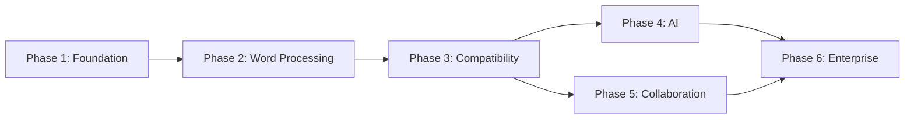

# Development Roadmap

Six phases over 24 months. Each phase has measurable exit criteria that must pass before the next phase begins.

## Phase 1: Editor Foundation (Months 1–3)

**Goal:** A working text editor with a document model, basic formatting, and save/load.

### Deliverables

- Core document model (tree of sections, paragraphs, runs)
- Text editing engine (cursor, selection, typing, delete)
- Undo/redo via command pattern
- Basic character formatting (bold, italic, underline, font, size, color)
- Basic paragraph formatting (alignment, line spacing, indentation)
- Native document format save/load
- Flutter shell with toolbar, document view, and status bar
- Rust/Flutter FFI bridge with display list rendering

### Exit Criteria

| Criterion | Measurement |
|-----------|-------------|
| Type and edit text with <10 ms latency | Benchmark: 1000 keystrokes, p99 < 10 ms |
| Apply bold/italic/underline to selection | Manual + automated test |
| Undo/redo 100 operations without data loss | Automated test |
| Save document, close, reopen — content identical | Round-trip test |
| Render a 10-page document at 60 FPS while scrolling | Frame time benchmark |
| Document model serializes to native format and deserializes losslessly | Automated round-trip test |

### Team: 6–8 engineers

| Role | Count |
|------|-------|
| Rust engine | 3 |
| Flutter UI | 2 |
| Rendering/layout | 1 |
| QA | 1 |
| Product/design | 1 |

---

## Phase 2: Word Processing (Months 4–6)

**Goal:** Pagination, rich content, and print-ready output.

### Deliverables

- Pagination engine (page size, margins, headers, footers)
- Style system (character styles, paragraph styles, document defaults)
- Image support (insert, resize, wrap text, crop)
- Table support (insert, merge/split cells, resize, nested tables)
- Lists (bulleted, numbered, multi-level)
- Print preview
- PDF export
- Rulers and page navigation UI

### Exit Criteria

| Criterion | Measurement |
|-----------|-------------|
| Document paginates correctly with headers/footers | Golden-image layout test |
| Apply "Heading 1" style — renders at correct size/weight/spacing | Style resolution test |
| Insert 5 images with text wrap — layout correct | Golden-image test |
| Create 3×3 table, merge cells, resize columns | Automated test |
| Multi-level numbered list renders with correct indentation | Golden-image test |
| Export to PDF — **structural** layout positions (Helvetica) | Automated PDF export test; **VisualMatch / font embedding deferred** ([risk-mitigation.md](risk-mitigation.md), [long-tail-gaps.md](long-tail-gaps.md)) |
| 50-page document scrolls at 60 FPS | Frame time benchmark |

### Team: 8–10 engineers (+2 layout, +1 UI)

---

## Phase 3: Office Compatibility (Months 7–10)

**Goal:** High-fidelity DOCX import/export and open format support.

### Deliverables

- DOCX import with package passthrough strategy
- DOCX export preserving unknown parts verbatim
- ODT import/export
- Markdown import/export
- HTML import/export
- Theme and template support
- Spell checking (Hunspell, English + Indic languages)
- Track changes (insert/delete formatting marks)
- DOCX compatibility test corpus (100+ real-world documents)

### Exit Criteria

| Criterion | Measurement |
|-----------|-------------|
| Import 100 real-world DOCX files — 95%+ render without visual defects | Automated corpus test |
| Round-trip 50 DOCX files — Tier A elements identical, Tier B preserved | Round-trip diff test |
| Open ODT file, edit, save as ODT — no data loss | Round-trip test |
| Import Markdown, export DOCX — headings, lists, bold/italic preserved | Conversion test |
| Spell check flags 10 known misspellings in test document | Automated test |
| Track changes: insert/delete visible with correct author/timestamp | Visual + data test |
| Open 500-page DOCX in <2 seconds | Benchmark |

### Team: 12–14 engineers (+2 file format, +1 QA)

---

## Phase 4: AI Integration (Months 11–14)

**Goal:** AI as a deeply integrated writing assistant with multi-provider abstraction.

### Deliverables

- AI sidebar (summarize, rewrite, translate, expand, shorten, explain, correct grammar)
- Inline writing suggestions (grammar, tone, style)
- Document chat ("What is this document about?", "List action items")
- AI template generation (resume, proposal, contract, meeting notes)
- **Hybrid routing** — task-based local/cloud selection (Automatic / Always Local / Always Cloud)
- **Multi-provider cloud** — OpenAI, Gemini, Claude, Mistral, OpenRouter, custom endpoint
- **Desktop local AI** — in-process llama.cpp (default); Ollama optional
- **Mobile local AI** — ONNX Runtime, Apple Foundation Models, Google AI Edge / LiteRT
- **AI module marketplace** — on-demand Grammar, Translation, Writing, Reasoning modules
- AI review (grammar, readability, accessibility, formatting consistency)

### Exit Criteria

| Criterion | Measurement |
|-----------|-------------|
| Rewrite selected paragraph — result appears in <3 seconds (cloud) | Latency benchmark |
| Summarize 20-page document — accurate summary in <10 seconds | Quality review |
| Local AI rewrite works offline with llama.cpp | Integration test |
| Automatic routing sends grammar to local, long summarize to cloud | HybridRouter unit test |
| AI sidebar responds to 10 standard prompts correctly | Prompt test suite |
| Inline grammar suggestion appears within 500 ms of pause (local) | Latency benchmark |
| Switch provider / routing mode without restart | Integration test |
| User can choose Always Local / Always Cloud / Automatic | Settings UI test |

### Team: 14–16 engineers (+2 AI/ML)

---

## Phase 5: Collaboration (Months 15–18)

**Goal:** Real-time multi-user editing with version history.

### Deliverables

- CRDT-based real-time editing (Yjs)
- Live cursors and presence indicators
- Comments and threaded replies
- Suggestions mode (track changes + accept/reject)
- Version history with diff view
- Cloud sync with offline queue
- Team workspaces and sharing

### Exit Criteria

| Criterion | Measurement |
|-----------|-------------|
| Two users edit same document — changes merge without conflict | CRDT convergence test |
| Live cursor visible within 200 ms of remote keystroke | Latency benchmark |
| Add comment, reply, resolve — full lifecycle works | Automated test |
| Accept/reject suggestion — document updates correctly | Automated test |
| Version history shows diff between any two versions | Visual diff test |
| Edit offline for 1 hour, reconnect — all changes sync | Offline sync test |
| 5 concurrent editors on 100-page document — no degradation | Load test |

### Team: 16–18 engineers (+2 backend)

---

## Phase 6: Enterprise & Ecosystem (Months 19–24)

**Goal:** Enterprise deployment, plugin marketplace, and compliance.

### Deliverables

- SSO integration (SAML/OIDC)
- Admin console (user management, policies, audit logs)
- On-premises deployment (Docker/Kubernetes)
- Data residency controls
- Plugin SDK (Rust, Python, JavaScript)
- Plugin marketplace
- Document automation APIs
- Digital signatures and document protection
- Compliance features (GDPR, SOC 2 readiness)

### Exit Criteria

| Criterion | Measurement |
|-----------|-------------|
| SSO login via SAML — user authenticated and session created | Integration test |
| Admin disables AI for org — AI features hidden for all users | Policy enforcement test |
| Deploy on-premises via Docker — full feature set operational | Deployment test |
| Install and run a sample plugin — extends editor functionality | Plugin SDK test |
| Plugin marketplace lists, installs, and updates plugins | Marketplace test |
| Audit log records all document access and edits | Compliance test |
| Password-protected DOCX opens with correct password | Security test |

### Team: 20 engineers (+1 DevOps, +1 technical writer)

---

## Phase Dependencies

Phase 4 (AI) and Phase 5 (Collaboration) can run in parallel after Phase 3 completes. Phase 6 requires both.

## Risk Register

Full matrix (severity, delivery stage S0–S5, residual risk, TC ladder, fidelity SLA): **[risk-mitigation.md](risk-mitigation.md)**. That document wins when this register conflicts with phase plan or long-tail gaps.

| Risk | Phase | Mitigation |
|------|-------|------------|
| Layout engine complexity underestimated | 1–2 | Self-goldens for regression + Word screenshot baselines (see risk-mitigation) |
| DOCX fidelity below corpus SLA | 2–3 | Passthrough + Tier A/B/C; DOCX on critical path from S1, not polish-only |
| Flutter `drawRawAtlas` performance insufficient | 1 | Benchmark early in Phase 1; fallback to texture-based rendering if needed |
| CRDT + track changes interaction complex | 5 | ADR-0007; finish TC accept/reject before collab (risk-mitigation ladder) |
| Local AI model quality insufficient | 4 | Cloud fallback always available; local AI is opt-in |
| Plugin sandbox security | 6 | WASM isolation default; native plugins require enterprise approval |
